# 56 — Diagrammes de séquence — Flux critiques

> **Objectif** : Documenter sous forme exécutable (Mermaid) les 8 flux les plus critiques du système, dans leur état cible post-refonte. Chaque diagramme inclut les composants impliqués, les transactions, les invariants à respecter, et les points de basculement (commit, rollback, audit, outbox).
>
> **Audience** : Devs implémentant les blocs, reviewers PR, ops debug prod, audits sécurité.
>
> **Convention** : Tous les diagrammes utilisent les mêmes acteurs/composants. Voir [§Légende](#légende).

---

## Sommaire

1. [Login + MFA + scope resolution](#1-login--mfa--scope-resolution)
2. [Conversion Devis → Réservation atomique](#2-conversion-devis--réservation-atomique)
3. [Annulation réservation cascade](#3-annulation-réservation-cascade)
4. [Vente épicerie atomique avec stock + loyalty](#4-vente-épicerie-atomique-avec-stock--loyalty)
5. [Marmite — préparation, consommation, audit](#5-marmite--préparation-consommation-audit)
6. [ETL routing TAIYAT/METRO/EUROCIEL](#6-etl-routing-taiyatmetroeurociel)
7. [Audit Outbox dispatching](#7-audit-outbox-dispatching)
8. [Réception fournisseur → stock_items](#8-réception-fournisseur--stock_items)
9. [Provisioning tenant DEVUP](#9-provisioning-tenant-devup)
10. [Export RGPD utilisateur](#10-export-rgpd-utilisateur)

---

## Légende

```
Acteurs / composants standards :
- C       = Client (frontend ou API consumer)
- API     = Endpoint FastAPI
- Auth    = Service authentification + scope resolver
- Svc     = Service métier (pricing, conversion, etc.)
- Repo    = Repository (accès SQLAlchemy)
- DB      = PostgreSQL
- Cache   = Redis
- Outbox  = Table outbox + dispatcher
- Audit   = Service audit (chain HMAC)
- Broker  = RabbitMQ (Celery)
- Worker  = Celery worker
- KMS     = Service de chiffrement enveloppe
- Notif   = Service notifications (email, SMS, push)

Conventions :
- Couleur rouge : transaction commit/rollback
- Couleur verte : succès / réponse positive
- Couleur orange : événement asynchrone
- Notes : invariants à vérifier à chaque étape
```

---

## 1. Login + MFA + scope resolution

> **Spec source** : Bloc 2 §2.3 (Auth Flow) + §2.5 (RBAC v3 scope resolution)
>
> **Endpoints impliqués** : `POST /auth/login`, `POST /auth/mfa/verify`
>
> **Invariants** :
> - I1 : JWT signé par clé privée KMS, vérifiable par JWKS public
> - I2 : Scope du JWT = intersection (rôles user × scopes vertical du tenant)
> - I3 : Audit log créé pour chaque login (succès ET échec)
> - I4 : Rate limiting par IP + par email (Redis sliding window)

```mermaid
sequenceDiagram
    autonumber
    participant C as Client
    participant API as API /auth/login
    participant RL as RateLimiter (Redis)
    participant Auth as AuthService
    participant Repo as AccountRepository
    participant DB as PostgreSQL
    participant KMS as KMS Service
    participant Cache as Redis (sessions)
    participant Audit as AuditService

    C->>API: POST /auth/login {email, password}
    API->>RL: check_rate_limit(ip, email)
    alt rate limit exceeded
        RL-->>API: 429 Too Many Requests
        API->>Audit: log("login.rate_limited", email, ip)
        API-->>C: 429
    else within limit
        RL-->>API: ok
        API->>Repo: find_account_by_email(email)
        Repo->>DB: SELECT * FROM accounts WHERE email = ?
        DB-->>Repo: account_row OR null

        alt account not found OR is_active=false
            Note over API,Audit: F1002 fix — audit explicite côté endpoint<br/>(/auth/login retiré de EXCLUDED_PATHS en B6.S2)<br/>Sprint 1 patch tactique : audit avant raise 401
            API->>Audit: log("auth.login.failed", actor_email=email, ip, reason="account_not_found")
            Note right of Audit: NEVER log password (masked)<br/>Stored: email + ip + user_agent + reason
            API-->>C: 401 Invalid credentials
        else account found
            Repo-->>API: Account entity

            API->>Auth: verify_password_argon2(password, account.password_hash)
            alt password invalide
                Auth-->>API: false
                API->>RL: increment_failure_count(ip, email)
                Note over API,Audit: F1002 fix — audit explicite branche échec<br/>(retrait /auth/login de EXCLUDED_PATHS en B6.S2 ; Sprint 1 = patch endpoint)
                API->>Audit: log("auth.login.failed", actor_email=email, account_id=account.id, ip, reason="invalid_password")
                Note right of Audit: NEVER log password (masked)
                API-->>C: 401 Invalid credentials
            else password valide
                Auth-->>API: true

                alt password needs rehash (params outdated)
                    API->>Auth: rehash(password) → new_hash
                    API->>Repo: update_password_hash(account.id, new_hash)
                end

                Note over API,Repo: MFA enrolement = présence d'au moins 1 auth_factor actif<br/>sur un membership de l'account (Bloc 2 Q6=B)
                API->>Repo: account_has_mfa(account.id)
                Repo->>DB: SELECT 1 FROM auth_factors af<br/>JOIN tenant_memberships tm ON tm.id = af.membership_id<br/>WHERE tm.account_id = ? AND af.is_active = true LIMIT 1

                alt MFA enrôlée
                    API->>Auth: create_mfa_pending_token(account.id)
                    Auth->>Cache: SET mfa_pending:{token} = account.id, EX 300
                    API->>Audit: log("login.mfa_required", account.id)
                    API-->>C: 200 {"mfa_required": true, "pending_token": "..."}
                    Note over C,Cache: Client appelle ensuite POST /auth/mfa/verify

                    C->>API: POST /auth/mfa/verify {pending_token, totp_code}
                    API->>Cache: GET mfa_pending:{token}
                    Cache-->>API: account_id

                    API->>Repo: find_active_totp_factor(account.id)
                    Repo->>DB: SELECT af.* FROM auth_factors af<br/>JOIN tenant_memberships tm ON tm.id = af.membership_id<br/>WHERE tm.account_id = ? AND af.type='TOTP' AND af.is_active=true
                    Repo-->>API: auth_factor (encrypted_secret)
                    API->>KMS: decrypt(encrypted_secret, context={auth_factor_id})
                    KMS-->>API: clear_secret

                    API->>Auth: verify_totp(clear_secret, totp_code)
                    alt TOTP invalide
                        Auth-->>API: false
                        API->>Audit: log("mfa.failed", account.id)
                        API-->>C: 401 Invalid MFA code
                    else TOTP valide
                        Auth-->>API: true
                    end
                end

                Note over API,Cache: Scope resolution — Bloc 2 §2.5

                API->>Auth: resolve_scopes(account, tenant)
                Auth->>Cache: GET scopes:{account.id}:{tenant.id}
                alt cache hit
                    Cache-->>Auth: cached_scopes
                else cache miss
                    Note over Auth,DB: user_role est mort (F339) — RBAC v3<br/>= TenantMembership.role + auth_vertical_scopes
                    Auth->>Repo: get_membership_role(account.id, tenant.id)
                    Repo->>DB: SELECT role FROM tenant_memberships<br/>WHERE account_id = ? AND tenant_id = ?
                    Auth->>Repo: get_vertical_scopes(tenant.vertical)
                    Repo->>DB: SELECT scope_name FROM auth_vertical_scopes<br/>WHERE vertical_code = ?
                    Auth->>Auth: scopes = intersection(role_scopes, vertical_scopes)
                    Auth->>Cache: SET scopes:{account.id}:{tenant.id} EX 300
                end
                Auth-->>API: scopes (list)

                API->>KMS: sign_jwt({sub, tenant_id, scopes, vertical, exp})
                KMS-->>API: jwt_token (signé EdDSA)

                API->>Cache: SET session:{jti} = account.id, EX 3600
                API->>Audit: log("login.success", account.id, ip, fingerprint)
                Note over Audit: chain HMAC : prev_hmac = last_hmac<br/>current_hmac = HMAC(secret, payload + prev_hmac)

                API-->>C: 200 {"access_token": jwt, "refresh_token": ..., "expires_in": 3600}
            end
        end
    end
```

### Détails critiques

| Étape | Détail | Justification |
|-------|--------|---------------|
| 3 | Rate limit double : IP (50/min) + email (5/min) | Anti-credential-stuffing + anti-brute-force ciblé |
| 9 | Hash systématique même si user inexistant | Empêche user enumeration par timing |
| 14 | Argon2 cost vérifié à chaque login | Migration progressive si params durcis |
| 21 | MFA pending token TTL 5min | Limite fenêtre attaque inter-étapes |
| 33 | Scope intersection rôles × vertical | Empêche fuite scopes inter-verticals |
| 41 | Cache TTL 5min, invalidé sur changement RBAC | Compromis perf/cohérence |

---

## 2. Conversion Devis → Réservation atomique

> **Spec source** : Bloc 3 §3.4 (Conversion atomique)
>
> **Endpoint** : `POST /devis/{id}/convert`
>
> **Invariants** :
> - I1 : Conversion atomique — soit tout réussit, soit tout est rollback
> - I2 : `devis.statut` passe `valide → converti` UNIQUEMENT après commit complet
> - I3 : Caution créée avec montant calculé selon `deposit_policy` du tenant
> - I4 : **Q12=A** — Invoice émise (`status='emitted'`, pas `draft`) dans la même TX que Réservation. Cf. architecture-cible.md §3.2.6.
> - I5 : Audit + Outbox dans la même transaction

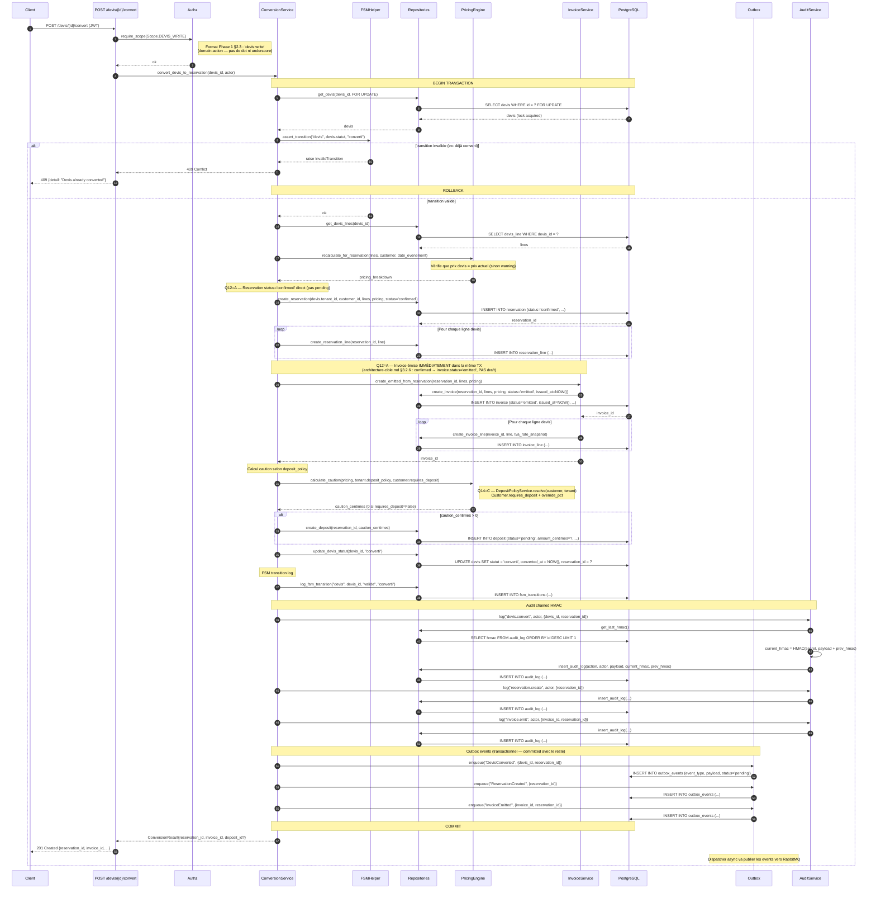

### Points critiques

| Étape | Détail | Conséquence si oublié |
|-------|--------|------------------------|
| `FOR UPDATE` lock sur devis | Race condition double-conversion possible |
| FSM transition matrix | Conversion en chaîne incohérente |
| Recalcul prix actuel | Devis stale → réservation à prix incorrect |
| **Q12=A — Invoice émise dans la même TX** | Réservation `confirmed` sans facture → IntegrityError ou facture orpheline si appel hors TX |
| **Q14=C — DepositPolicyService.resolve(customer, tenant)** | Faux montant caution (Customer.requires_deposit ignoré) |
| Audit chain prev_hmac | Tampering détectable |
| Outbox dans la même TX | Event publié sans commit DB → état incohérent |

---

## 3. Annulation réservation cascade

> **Spec source** : Bloc 3 §3.6 (Cancellation cascade)
>
> **Endpoint** : `POST /reservations/{id}/cancel`
>
> **Invariants** :
> - I1 : Annulation libère stock réservé (cascade vers stock_movements)
> - I2 : Caution remboursée selon politique (full / partial / none)
> - I3 : Notifications client envoyées via Outbox (pas synchrone)
> - I4 : Statut fenêtre H-72 : refus avec 409 si politique restrictive

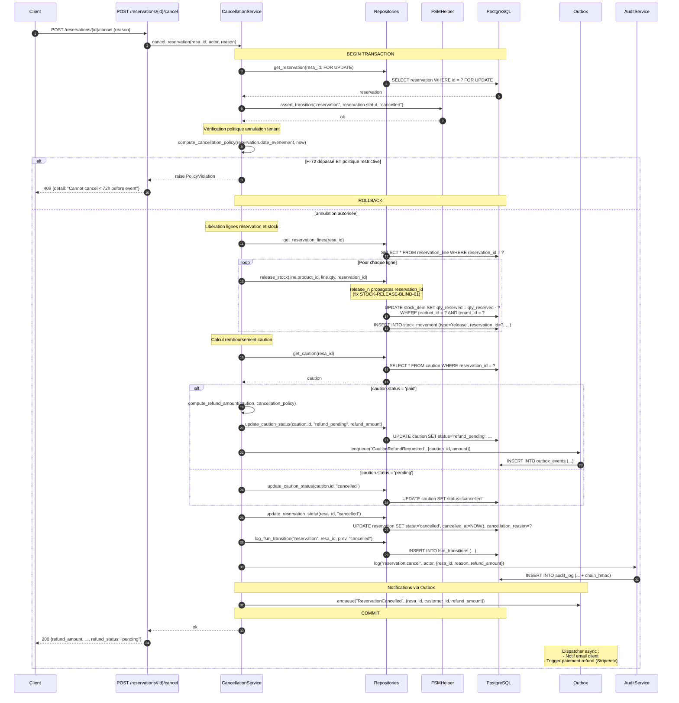

---

## 4. Vente épicerie atomique avec stock + loyalty

> **Spec source** : Bloc 5 §5.4 (Encaissement épicerie)
>
> **Endpoint** : `POST /epicerie/ventes/encaisser`
>
> **Invariants** :
> - I1 : Stock decrement atomique avec advisory lock par stock_item
> - I2 : Loyalty points accordés UNIQUEMENT après paiement validé
> - I3 : Audit + Outbox dans même transaction
> - I4 : Si stock insuffisant, 409 — pas de partial

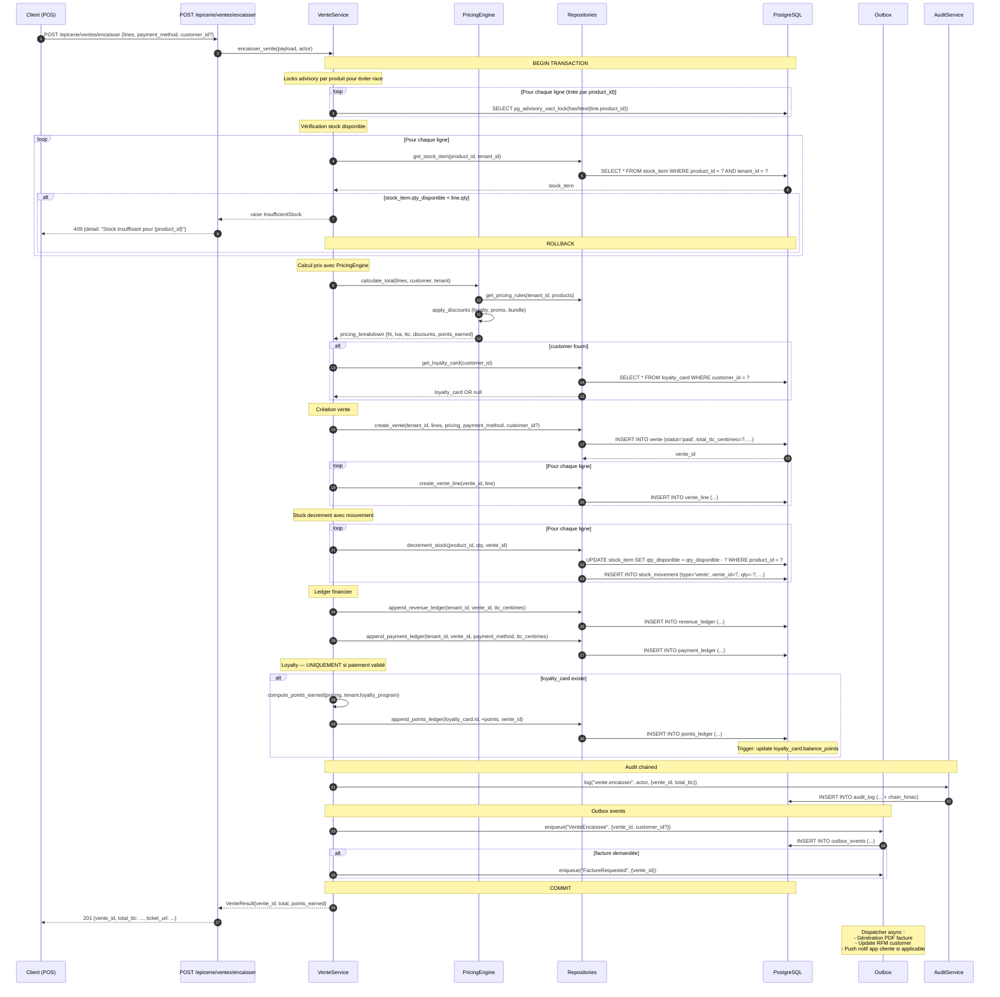

---

## 5. Marmite — préparation, consommation, audit

> **Spec source** : Bloc 5 §5.7 (Restaurant marmite)
>
> **Endpoint** : `POST /restaurant/instances` puis consommation à la commande
>
> **Invariants** :
> - I1 : Lancement marmite décrémente ingrédients selon recette × portions_max
> - I2 : Consommation à la commande utilise `qte_par_portion` (PAS `quantite_par_portion` — fix F906)
> - I3 : Pertes capturées en fin de service via mouvement stock dédié
> - I4 : Audit pour chaque étape

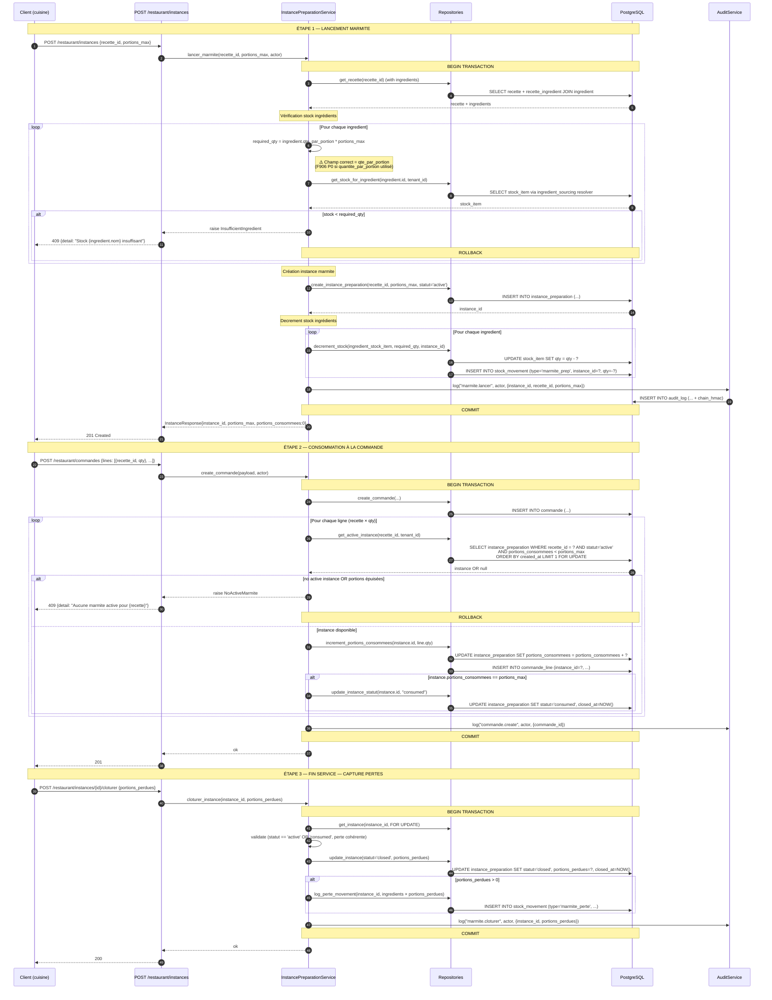

### Bug F906 prévention

```python
# app/services/restaurant/instance_preparation.py
# AVANT (bug F906) :
required_qty = ingredient.quantite_par_portion * portions_max  # ❌ AttributeError

# APRÈS (fix Sprint 1) :
required_qty = ingredient.qte_par_portion * portions_max  # ✅
```

---

## 6. ETL routing TAIYAT/METRO/EUROCIEL

> **Spec source** : Bloc 5 §5.2 (ETL strategy)
>
> **Endpoint** : `POST /etl/imports` puis `POST /etl/imports/{id}/validate`
>
> **Invariants** :
> - I1 : Routing parser basé sur `vendor_code` détecté ou imposé par utilisateur
> - I2 : Idempotence garantie — `validate_import` n'introduit pas de doublons (fix ETL-DUPE-01)
> - I3 : Échec parser doit être actionnable (message clair, ligne, champ)
> - I4 : Création produit catalogue automatique si vendor reconnu et produit nouveau

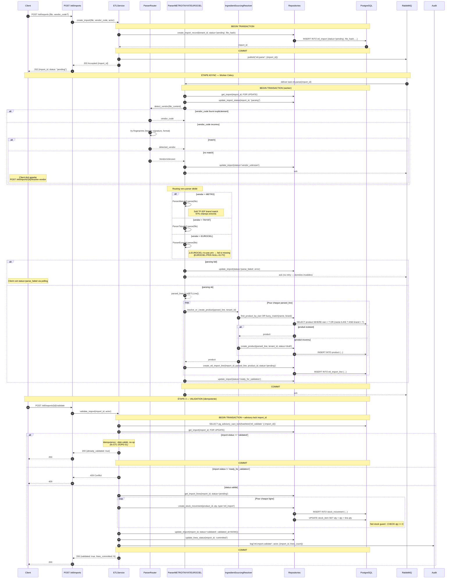

---

## 7. Audit Outbox dispatching

> **Spec source** : Bloc 1 §1.4 (Outbox pattern)
>
> **Tâche** : Worker Celery `outbox_dispatcher` (poll 5s)
>
> **Invariants** :
> - I1 : Exactement-une-fois delivery via dedup_key + idempotence broker
> - I2 : Failed events retry exponential backoff, max 5 retries → DLQ
> - I3 : Audit chain integrity vérifiable nightly

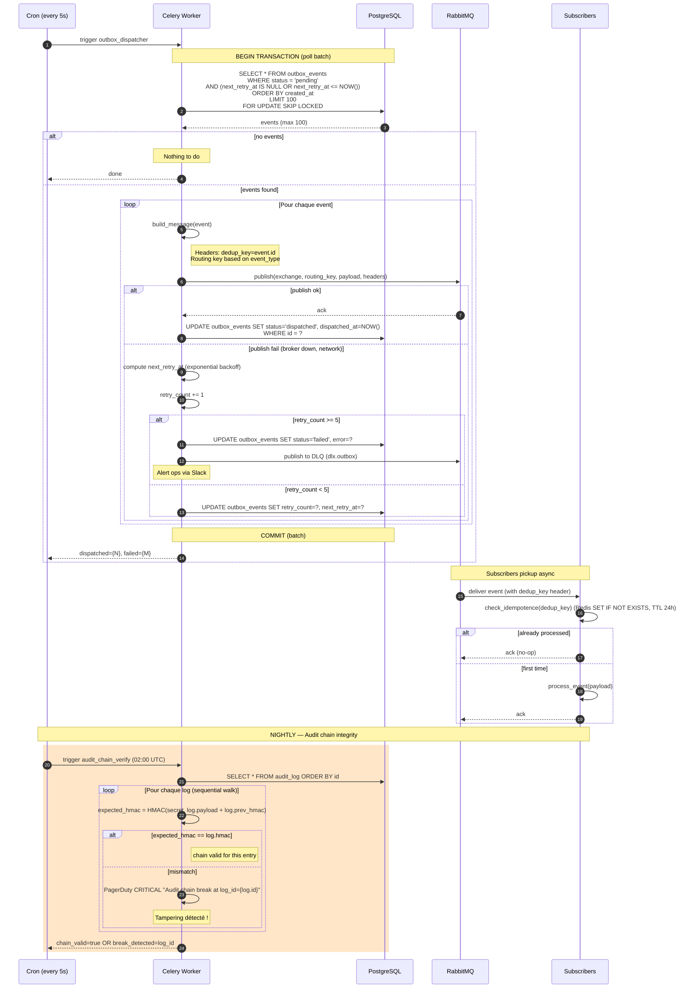

---

## 8. Réception fournisseur → stock_items

> **Spec source** : Bloc 5 §5.3 (Réception fournisseur)
>
> **Endpoint** : `POST /receptions/{id}/valider`
>
> **Invariants** :
> - I1 : Réception valide crée mouvements stock + update CMP/PMP
> - I2 : `stock_items` agrégés : un par (product_id, tenant_id) avec qty et CMP
> - I3 : Trigger DB met à jour `product_stock_view` (materialized)

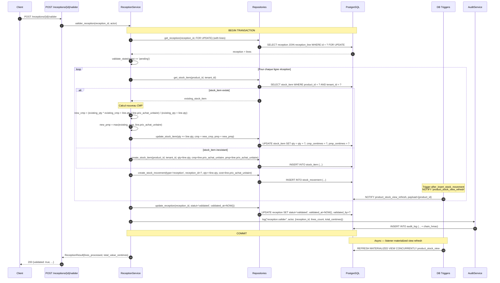

### Calcul CMP/PMP

```
CMP (Coût Moyen Pondéré) :
  CMP_new = (qty_old * CMP_old + qty_recue * prix_achat_unitaire) / (qty_old + qty_recue)

PMP (Prix Moyen Pondéré le plus haut) :
  PMP_new = max(PMP_old, prix_achat_unitaire)

Utilisé pour :
- Valorisation stock comptable
- Marge théorique vente (prix_vente - CMP)
- Alerte achat plus cher que d'habitude (line.prix > PMP * 1.20)
```

---

## 9. Provisioning tenant DEVUP

> **Spec source** : Bloc 7 §7.4 (Provisioning workflow)
>
> **Endpoint** : `POST /admin/devup/tenants/provision`
>
> **Invariants** :
> - I1 : Atomique — TOUTE la séquence (Tenant + TenantBrand + TenantSettings + Membership initial + Outbox) est dans **un seul `async with session.begin():`**. Échec partiel impossible (F256 fix vague 3).
> - I2 : Vertical détermine seed data (rôles, scopes, configs)
> - I3 : Premier admin user créé avec password temporaire envoyé par email
> - I4 : Audit log spécifique DEVUP émis via Outbox (reste atomique avec le reste)

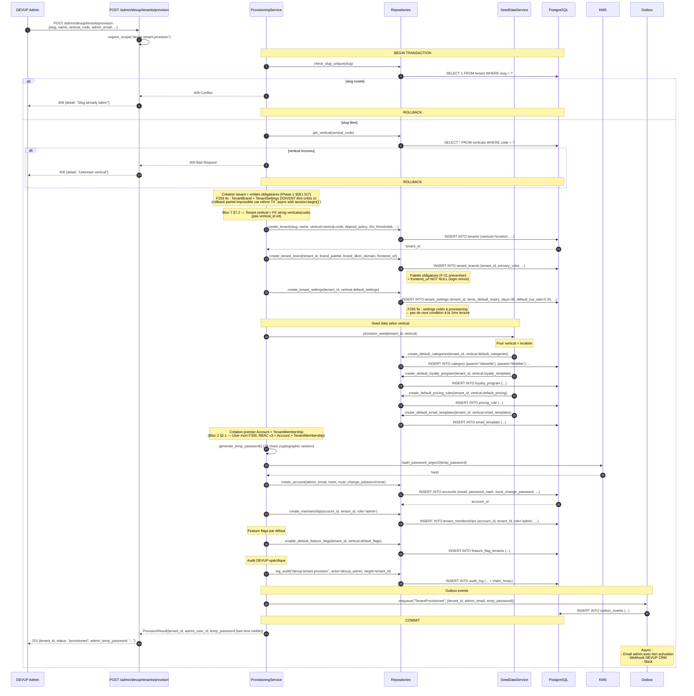

---

## 10. Export RGPD utilisateur

> **Spec source** : Bloc 6 §6.3 (RGPD Article 15)
>
> **Endpoints** : `POST /me/export`, `GET /me/exports/{task_id}/status`
>
> **Invariants** :
> - I1 : Export async — réponse immédiate avec task_id
> - I2 : PII déchiffrées au moment de l'export, contenu signé
> - I3 : Lien téléchargement TTL 24h, à usage unique
> - I4 : Audit log avec actor=user (auto-export)

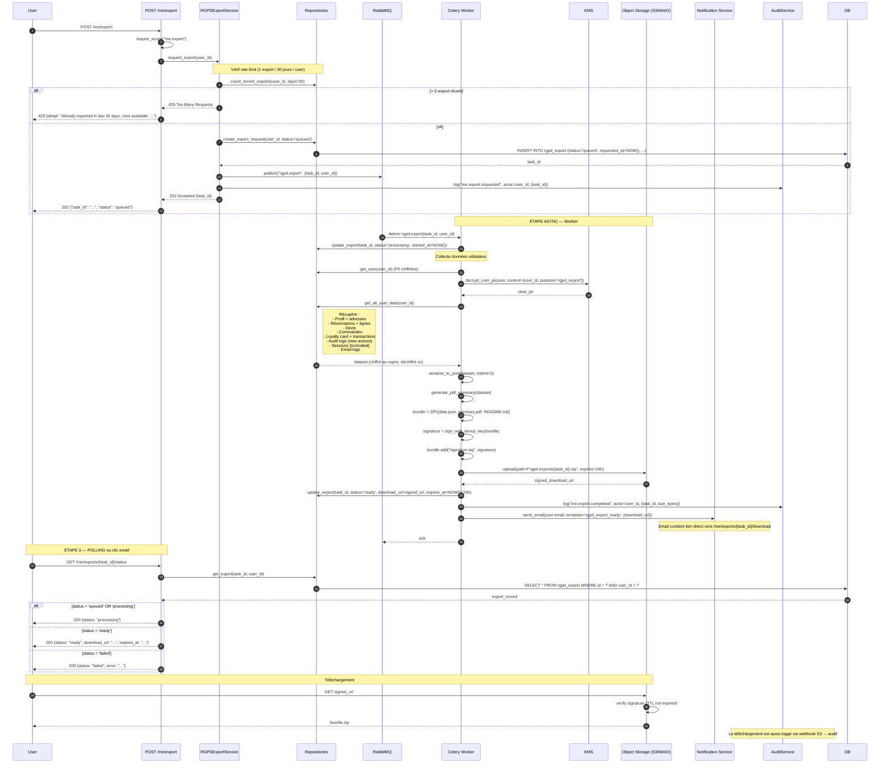

---

## Annexes

### A. Convention rendu Mermaid

Tous les diagrammes ci-dessus sont valides Mermaid v10+ et rendus automatiquement par GitHub, GitLab, et la plupart des plateformes de doc (Notion, Confluence avec plugin).

Pour valider en local :
```bash
npm install -g @mermaid-js/mermaid-cli
mmdc -i 56-sequence-diagrams.md -o /tmp/diagrams/
```

### B. Mise à jour

Tout changement de flux critique impose :
1. Mise à jour du diagramme dans ce fichier
2. Update commit `docs(seq): update flow X for Y`
3. Review obligatoire par Lead Architect

### C. Diagrammes additionnels possibles (post-Phase 3)

Si nécessaire, ajouter :
- Workflow transfer-request (B5.S6)
- Audit chain verification nightly détail
- mTLS handshake /metrics scrape
- ETL EUROCIEL fuzzy match flow (post-fix EUROCIEL-PRIX-NULL-01)
- Rotation clés JWT (KMS)
- Rolling deployment zero-downtime

---

## 11. OAuth callback avec MFA gate (F404 — vague 5)

> **Spec source** : `13-apikey-oauth-passwordreset.md` §F404 + correction Sprint 1 T10
>
> **Endpoint** : `GET /auth/oauth/{provider}/callback`
>
> **Invariants** :
> - I1 : Si l'account a au moins 1 `auth_factor` actif → MFA challenge obligatoire (pas de bypass via Google/MS)
> - I2 : `mfa_verified` flag de session reflète l'état réel (pas `False` hardcodé)
> - I3 : Audit explicite des flows OAuth (success + mfa_required + failed)

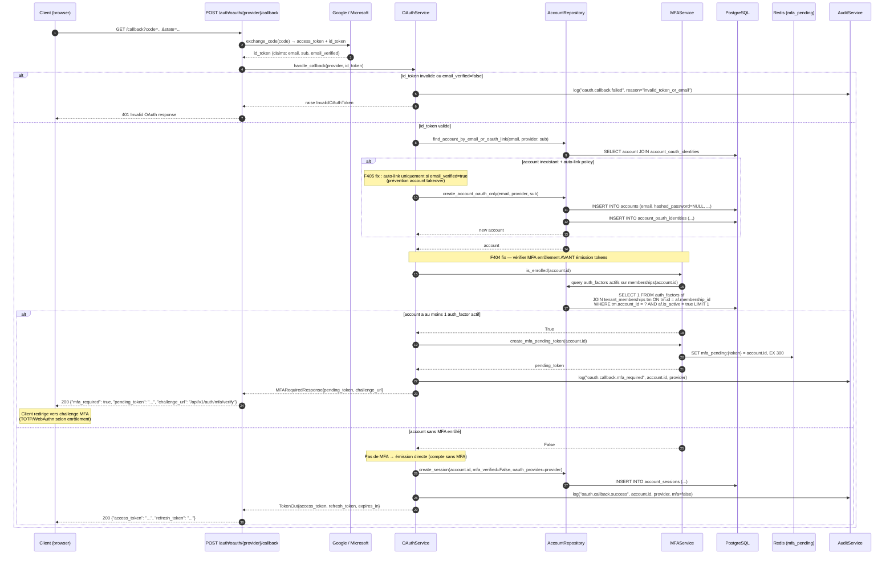

### Invariant CI associé

`check_no_mfa_bypass_oauth.py` (54-ci-invariants §20) — refuse le merge si une fonction
`_issue_oauth_tokens` ou `_open_session_and_issue` émet TokenOut sans appeler
`mfa_service.is_enrolled()` ou équivalent dans son corps.

---

## 12. WebAuthn enregistrement avec RP_ID per-tenant (F368 — vague 4)

> **Spec source** : `12-mfa-webauthn-pin.md` §F368 + correction Sprint 1 T11
>
> **Endpoints** : `POST /auth/webauthn/register/options`, `POST /auth/webauthn/register/verify`
>
> **Invariants** :
> - I1 : `rp_id` lu depuis `tenants.rp_id` (per-tenant), pas constante globale
> - I2 : `expected_origin` lu depuis `tenants.frontend_url` (per-tenant)
> - I3 : Démo Splendid 28/04 : enrôlement WebAuthn fonctionnel sur `splendid.events`

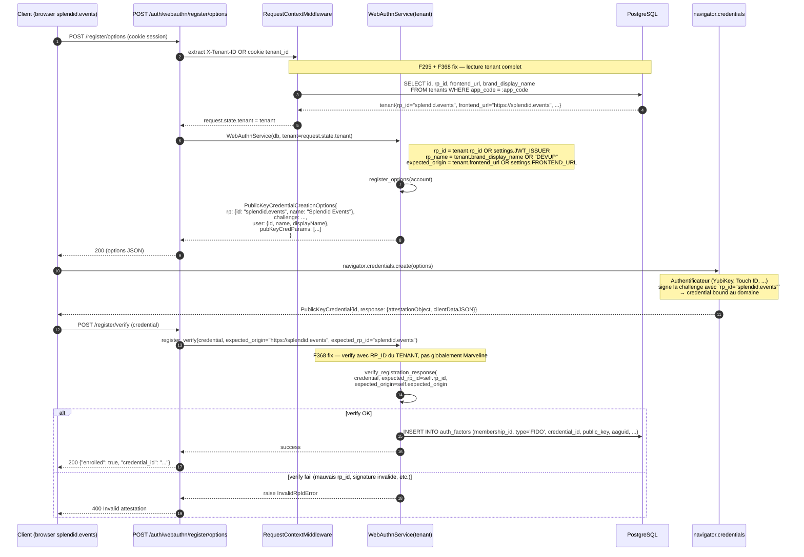

### Régression bloquée

Si un dev hardcode `RP_ID = "marveline.com"` à la place de `tenant.rp_id` :
- INV-13 (53-tests-strategy §8.13) `test_invariant_webauthn_register_options__uses_tenant_rp_id` détecte → CI rouge
- Démo Splendid 28/04 reste protégée car le test E2E inclut un setup `tenant.rp_id="splendid.events"`

---

**Fin du document — 56-sequence-diagrams.md**
